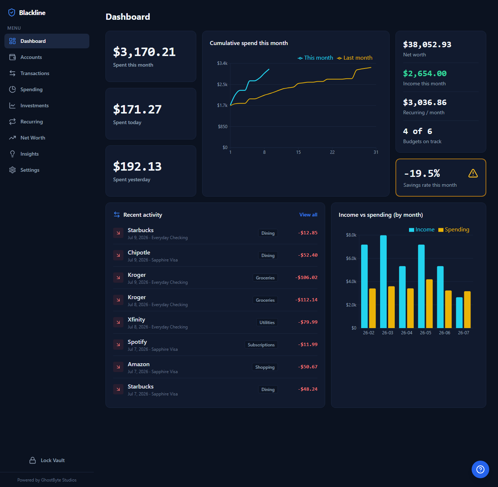

# Blackline

**Your private, local-first personal finance dashboard.**

Blackline aggregates your bank and investment accounts, then shows you spending
trends, budgets, net worth, recurring charges, and tailored insights — all running
entirely on your own machine. Your financial data never leaves your computer except
during a sync you explicitly trigger, and even then only a single read-only request
goes out to the account aggregator you connected.

> ⚠️ **Not financial advice.** Blackline is a personal tool for visualizing your own
> money. Its budgeting guidance (50/30/20, debt-to-income, etc.) consists of common
> rules of thumb, not professional advice. It comes with **no warranty** (see [License](#license)).



*The dashboard, running on built-in demo data — no bank connection required to try it.*

---

## Table of contents

- [Why Blackline](#why-blackline)
- [Features](#features)
- [Security at a glance](#security-at-a-glance)
- [What you need before you start](#what-you-need-before-you-start)
- [The cost: SimpleFIN](#the-cost-simplefin)
- [Setup](#setup)
- [First launch — create your vault](#first-launch--create-your-vault)
- [Connecting your accounts](#connecting-your-accounts)
- [Using the app](#using-the-app)
- [Backing up your data](#backing-up-your-data)
- [Configuration](#configuration)
- [Project structure](#project-structure)
- [Troubleshooting](#troubleshooting)
- [Tech stack](#tech-stack)
- [Contributing](#contributing)
- [License](#license)

---

## Why Blackline

Most personal-finance apps require you to hand your data — and often your bank
login — to a company's cloud. Blackline takes the opposite approach:

- **It runs only on `127.0.0.1`.** There is no hosted server, no account on someone
  else's infrastructure, nothing exposed to your network or the internet.
- **It never sees your bank password.** Account linking happens on the
  [SimpleFIN Bridge](https://www.simplefin.org/), which hands back a *read-only*
  access token. Blackline can read balances and transactions; it can never move money.
- **Everything is encrypted at rest.** The entire database lives on disk only as a
  single AES-256-GCM-encrypted blob, unlocked by a passphrase that only you know.

---

## Features

- **Dashboard** — a dense, dark command center: spent today/yesterday/this month, a
  cumulative spend-pace chart (this month vs. last), net worth, income, recurring total,
  budgets on track, a savings-rate health tile, recent activity, and income-vs-spending
  history — all on one screen.
- **Demo mode** — one click loads a realistic six-month fictional household so you can
  try everything before connecting a bank (and one click removes it).
- **Accounts** — label each account (checking, savings, investment, credit, loan…) and set savings goals with progress bars.
- **Transactions** — automatically categorized; correct one and Blackline *learns a rule* and applies it to every similar charge.
- **Spending & budgets** — category breakdowns, income-vs-spending trends, and inline-editable monthly budgets (with a one-click "suggest from income" using 50/30/20).
- **Investments** — holdings, allocation, and portfolio value.
- **Recurring** — auto-detects fixed-price subscriptions, bills, and loan payments while ignoring variable retail spending.
- **Net worth** — historical net-worth tracking that accumulates with each sync.
- **Insights** — flags spending spikes, budget overruns, idle high-yield-eligible cash, and budgeting-ratio guidance (housing, transport, debt-to-income, 50/30/20).
- **CSV export** — download your transactions (optionally date-filtered) for spreadsheets or taxes.
- **Guided tutorial** — an in-app walkthrough that opens on first run and is reopenable anytime via the **?** button.

---

## Security at a glance

| Control | How |
|---|---|
| Network exposure | Server binds `127.0.0.1` only and **refuses to start** on any non-localhost host. CORS limited to the local frontend. |
| Encryption at rest | Whole database stored only as an **AES-256-GCM** blob (`blackline.db.enc`). No plaintext database file ever touches disk. |
| Key derivation | **Argon2id** (memory-hard) from your passphrase + a per-install random salt. The key lives in memory only while unlocked. |
| Credentials | Your bank login is handled by SimpleFIN, never by Blackline. The read-only access token is itself encrypted inside the vault. |
| Egress | Exactly one outbound destination (the SimpleFIN Bridge host), only during a sync you start. |
| Brute-force resistance | Escalating delays after repeated failed unlock attempts (on top of Argon2id's ~1s/attempt cost). |
| Auto-lock | The vault locks itself after 15 idle minutes (configurable). |
| Backups | Each sync first rotates a timestamped copy of the encrypted blob into `data/backups/` (same ciphertext-only safety). |
| Forgotten passphrase | No recovery — by design. A guarded **reset** on the lock screen destroys the vault so you can start over. |

The full threat model — including known trade-offs — is in **[SECURITY.md](./SECURITY.md)**.

> 🔑 **There is no passphrase recovery.** The passphrase *is* the encryption key. If you
> lose it, the encrypted data cannot be decrypted by anyone, including you. Choose
> something strong and memorable, and consider a password manager.

---

## What you need before you start

| Requirement | Notes |
|---|---|
| **Python 3.11+** | The at-rest encryption uses `sqlite3` serialization added in Python 3.11. Tested through 3.14. |
| **Node.js 20+** | For the frontend dev server. Get it from [nodejs.org](https://nodejs.org). |
| **A SimpleFIN Bridge account** | Required to link real accounts. See below. |
| **Git** | To clone the repository. |

---

## The cost: SimpleFIN

Blackline itself is free and open source. To pull in **real** account data it relies on
the **[SimpleFIN Bridge](https://bridge.simplefin.org/)**, a third-party service that
securely connects to your banks and exposes a read-only feed.

- SimpleFIN Bridge costs about **$1.50/month** (with a free trial).
- That fee is paid **to SimpleFIN, not to this project** — Blackline never handles payments.
- **You** create the Bridge account and link your banks there. This is by design: it's
  the privacy boundary that keeps your bank credentials out of Blackline entirely.

**You don't need SimpleFIN to try Blackline.** Create a vault, then go to
**Settings → Demo Mode → Load demo data** for a realistic fictional household —
five accounts and six months of activity powering every chart and insight. Remove it
with one click before connecting your real bank (demo data never mixes with real data).

---

## Setup

Clone the repo, then start the backend and frontend in two terminals.

```bash
git clone https://github.com/ghostbytestudios/blackline.git
cd blackline
```

### 1. Backend (FastAPI)

<details open>
<summary><b>Windows (PowerShell)</b></summary>

```powershell
cd backend
python -m venv .venv
.\.venv\Scripts\Activate.ps1
pip install -r requirements.txt
# Optional: copy .env.example .env   (defaults are already secure)
uvicorn app.main:app --host 127.0.0.1 --port 8000
```
</details>

<details>
<summary><b>macOS / Linux</b></summary>

```bash
cd backend
python3 -m venv .venv
source .venv/bin/activate
pip install -r requirements.txt
# Optional: cp .env.example .env   (defaults are already secure)
uvicorn app.main:app --host 127.0.0.1 --port 8000
```
</details>

You do **not** need a `.env` file — the defaults run securely on localhost. Copy
`.env.example` to `.env` only if you want to change a port or tune Argon2.

### 2. Frontend (React + Vite)

In a **second terminal**:

```bash
cd frontend
npm install
npm run dev
```

### 3. Open the app

Visit **http://127.0.0.1:5173** in your browser. The frontend proxies API calls to the
backend on port 8000.

---

## First launch — create your vault

On first run there is no data and no passphrase yet. Blackline will prompt you to
**create a passphrase** (minimum 8 characters). This passphrase:

- Encrypts your entire local database.
- Is required every time you unlock the app.
- **Cannot be recovered** if lost (see the warning above).

After creating it, you're in. The app starts empty until you connect an account.

---

## Connecting your accounts

1. Go to **Settings → Bank Connection** and click **Open SimpleFIN Bridge**. A focused
   popup opens the Bridge.
2. In the Bridge: create/sign in to your SimpleFIN account, **connect your bank(s)**
   (this is where you log into your bank — Blackline never sees this), and generate a
   **Setup Token**. Copy it.
3. Return to Blackline. It will **auto-detect the token from your clipboard** and pre-fill
   it (you'll see a green "Token detected" confirmation). If your browser blocks
   clipboard access, just paste it manually.
4. Click **Connect & Sync**. Blackline exchanges the one-time setup token for a
   read-only access URL, encrypts it, and pulls your accounts and transactions.

To add more banks later, link them at the Bridge and just hit **Sync now** — no new
token needed.

> SimpleFIN's free tier caps transaction history at about 90 days. Net-worth history
> accumulates going forward from your first sync (past balances can't be backfilled).

---

## Using the app

| Page | What it's for |
|---|---|
| **Dashboard** | Spending pace vs. last month, spent today/yesterday/MTD, net worth, income, recurring total, budget status, savings-rate health, recent activity. |
| **Accounts** | Set each account's role (checking/savings/investment/credit/loan) and savings goals. Roles drive correct cash-flow and insight calculations. |
| **Transactions** | Review and re-categorize. Editing a category creates a learned rule applied to all similar charges. |
| **Spending** | Category pie, income-vs-spending bars, and inline-editable **Monthly Budgets**. Add your income in Settings to unlock "Suggest from income". |
| **Investments** | Holdings table and allocation. (Cost basis/gains appear only if your provider supplies them.) |
| **Recurring** | Detected subscriptions and recurring charges. |
| **Net Worth** | Historical net worth once a few snapshots exist, otherwise a labeled estimate. |
| **Insights** | Severity-grouped cards: spikes, budget overruns, idle cash, and budgeting-ratio guidance. |
| **Settings** | Connect/disconnect SimpleFIN, demo mode, CSV export, set income, change passphrase. |

**Locking:** Click **Lock Vault** in the sidebar whenever you step away — or just walk
away: the vault auto-locks after 15 idle minutes. Either way, the decryption key is
dropped from memory and your passphrase is required to get back in.

**Forgot your passphrase?** There is no recovery — the passphrase *is* the key. The
lock screen has a **"Forgot your passphrase?"** flow that permanently destroys the
vault (typed confirmation required) so you can start fresh.

**Syncing:** Use **Sync now** in Settings whenever you want fresh data. The app is
otherwise fully offline.

---

## Backing up your data

All of your data lives in **`backend/data/`**:

- `blackline.db.enc` — your encrypted database.
- `vault.salt` — the salt used to derive your key.
- `backups/` — timestamped copies of the encrypted blob, rotated automatically before
  each sync (the newest five are kept by default).

**Both files are required to decrypt**, and both are excluded from git. To back up,
copy the entire `backend/data/` folder somewhere safe. To restore, put the files back
and unlock with the same passphrase. Because the database is encrypted, the backup is
safe to store on external/cloud storage — but your passphrase is still the only key.

---

## Configuration

All settings are optional and read from environment variables (or a `backend/.env`
file), prefixed with `BLACKLINE_`. The defaults are secure for local use.

| Variable | Default | Purpose |
|---|---|---|
| `BLACKLINE_DATA_DIR` | `data` | Where the encrypted DB + salt are stored. |
| `BLACKLINE_HOST` | `127.0.0.1` | Bind address. **Must stay localhost** — the app refuses to start otherwise. |
| `BLACKLINE_PORT` | `8000` | Backend port. |
| `BLACKLINE_FRONTEND_ORIGIN` | `http://127.0.0.1:5173` | Allowed CORS origin. |
| `BLACKLINE_SIMPLEFIN_ALLOWED_HOST` | `bridge.simplefin.org` | The only permitted outbound host. |
| `BLACKLINE_ARGON2_TIME_COST` | `3` | Argon2id iterations. |
| `BLACKLINE_ARGON2_MEMORY_KIB` | `262144` | Argon2id memory (256 MiB). |
| `BLACKLINE_ARGON2_PARALLELISM` | `4` | Argon2id lanes. |
| `BLACKLINE_AUTO_LOCK_MINUTES` | `15` | Lock the vault after this many idle minutes (`0` = never). |
| `BLACKLINE_BACKUP_COUNT` | `5` | Encrypted-blob backups to keep (`0` = disable). |

---

## Project structure

```
blackline/
├── backend/                 FastAPI app (Python)
│   ├── app/
│   │   ├── config.py        Env-driven settings, localhost enforcement
│   │   ├── db.py            Encrypted in-memory database layer + backup rotation
│   │   ├── migrate.py       In-process Alembic runner (migrations apply at unlock)
│   │   ├── models.py        ORM: accounts, transactions, holdings, budgets, …
│   │   ├── schemas.py       Pydantic API contracts
│   │   ├── security/        crypto, key derivation, secret vault, app lock, throttle
│   │   ├── integrations/    SimpleFIN Bridge client (the only network egress)
│   │   ├── services/        sync, categorization, insights, dashboard, recurring, demo
│   │   ├── routers/         HTTP API endpoints
│   │   └── main.py          App wiring, 127.0.0.1 bind, security headers, auto-lock
│   ├── migrations/          Alembic migration scripts (see migrations/README.md)
│   ├── tests/               pytest suite (~80 tests)
│   ├── requirements.txt
│   └── .env.example
├── frontend/                React + Vite + Tailwind dashboard (dark theme)
│   └── src/{pages,components,hooks,lib}
├── docs/                    Screenshots
├── README.md
├── SECURITY.md              Threat model & controls
└── LICENSE                  GNU GPL v3
```

---

## Troubleshooting

- **"Cannot reach the backend."** The frontend is up but the API isn't. Make sure
  `uvicorn app.main:app` is running on `127.0.0.1:8000` in your backend terminal.
- **The app refuses to start with a host error.** `BLACKLINE_HOST` is set to something
  other than localhost. This is intentional — set it back to `127.0.0.1`.
- **Clipboard token didn't auto-fill.** Your browser blocked clipboard access. Just
  paste the token into the box manually; it works the same.
- **"Incorrect passphrase."** Encryption is authenticated — a wrong passphrase can't
  decrypt the blob. Double-check it. There is no recovery if it's truly lost.
- **`pip install` fails building a wheel (Python 3.14).** Some libraries lacked 3.14
  wheels historically; `requirements.txt` is pinned to versions that have them. If you
  hit a build error, ensure you're on the pinned versions or use Python 3.11–3.13.
- **Sync returns no/old transactions.** SimpleFIN's free tier limits history to ~90 days.

---

## Tech stack

- **Backend:** Python, FastAPI, SQLAlchemy, Alembic, SQLite (in-memory + encrypted blob),
  cryptography (AES-256-GCM), argon2-cffi, httpx, pytest.
- **Frontend:** React, TypeScript, Vite, Tailwind CSS, TanStack Query, Recharts.
- **Aggregation:** SimpleFIN Bridge (read-only, consent-based).

---

## Contributing

Contributions are welcome. If you fork or extend Blackline, please **keep the security
posture intact**: localhost-only binding, read-only aggregation, no credential storage,
and encryption at rest. Open an issue or PR with a clear description of the change.

---

## License

Blackline is licensed under the **GNU General Public License v3.0**. See [LICENSE](./LICENSE).

In short: you may use, study, share, and modify this software, but any distributed
derivative must also be released under the GPLv3. The software is provided **with no
warranty of any kind**.

```
Copyright (C) 2026  GhostByte Studios

This program is free software: you can redistribute it and/or modify it under the
terms of the GNU General Public License as published by the Free Software Foundation,
either version 3 of the License, or (at your option) any later version.

This program is distributed in the hope that it will be useful, but WITHOUT ANY
WARRANTY; without even the implied warranty of MERCHANTABILITY or FITNESS FOR A
PARTICULAR PURPOSE. See the GNU General Public License for more details.
```

---

*Built by GhostByte Studios.*
